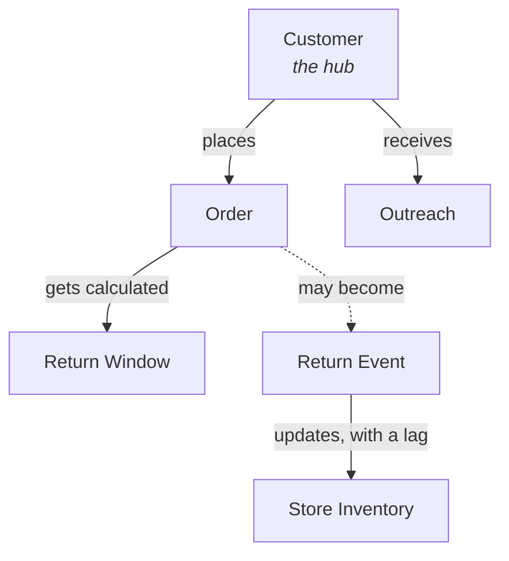

# Post-Purchase Operations Workbench

## The problem

Retail associates at a premium denim brand lose selling time to a broken data pipeline. Customers call the store roughly 7 times a day asking whether they can still return an item — the posted policy exists online, but actual return windows vary by case (fraud risk, VIP status, relationship), and neither the customer nor the associate can see the purchase date and applicable window without digging through a back-office system and doing manual math. Every call pulls an associate away from face-to-face clients on the floor.

Meanwhile, when returns do happen, inventory systems update so slowly that a returned item becomes invisible: an associate tells a client a size is out of stock while that exact pair sits at another store, just returned and sellable.

The company isn't missing software — it's drowning in point solutions (returns portal, support platform, outreach app, POS) that don't talk to each other. One root cause underneath everything: no shared data map connecting customers, orders, returns, and store inventory.

This project integrates those fragmented sources into a unified data model (an "ontology") and delivers an associate workbench with three surfaces: instant return-window answers, true inventory visibility including pending returns, and reason-driven outreach.

## The data map

See **[ontology.md](ontology.md)** for the full diagram and explanation. Short version: six objects, five relationships, with `Customer` as the hub — every other object hangs off a *resolved* identity, not a raw, possibly-duplicated source record.



## What's in this repo

```
common/           shared constants, nickname table, RNG seed
data_generation/  synthetic data generator (pandas + faker)
raw/              9 generated CSVs — the messy source data
pipeline/         ingestion, entity resolution, derived fields, outreach, analytics
clean/            pipeline outputs the app reads from
app/              Streamlit workbench (3 screens + governance layer)
ground_truth/     answer key used only to grade entity resolution (not a deliverable)
logs/             runtime audit log (created when the app runs)
ontology.md       the data map, diagrammed
```

All data is synthetic — there's no real company behind this. `data_generation/` builds ~500 customers, ~3,000 orders, 450 returns, and related records with the kind of messiness real retail systems actually produce (inconsistent date formats, duplicate customer records, missing fields), plus a hidden ground-truth answer key so entity resolution can be graded instead of eyeballed.

## Running it

```bash
pip install -r requirements.txt

python3 -m data_generation.run_all        # generates raw/
python3 -m pipeline.run_phase1            # ingestion + entity-resolution spine
python3 -m pipeline.run_phase2            # customer fields, return windows, true inventory
python3 -m pipeline.run_phase3            # outreach queue + analytics

streamlit run app/app.py                  # the workbench, at localhost:8501
```

Optional sanity check — grades the spine against the hidden ground truth:

```bash
python3 -m pipeline.validate_against_ground_truth
```

## The app

Three screens, plus a role toggle (Associate / Manager) that gates exact spend, contact details, and flag logic to managers only, and an audit log that records every lookup:

1. **Return Lookup** — search by name, phone, email, or order number; see tier, return status, and window in one card.
2. **True Inventory** — search item + size + color; see official count vs. true availability, including sellable returns that haven't been reshelved yet.
3. **Outreach + Analytics** (manager only) — the reason-driven outreach queue, associate time-lost analytics, return-reason clustering by style, and the entity-resolution review queue.

---

## Progress log

### Session 3 — Phase 3: outreach, analytics, governance
Built the reason-driven outreach queue (window closing, VIP dormant, or — the flip side of the ghost-stock story — a customer who called asking about an item that just got returned in their size). Extended `call_log.csv` to carry which customer asked about which item, so that last trigger is a real traceable match, not a guess. Added manager analytics (time lost to return calls, return-reason clustering by style, honest old-vs-new outreach comparison — no fabricated conversion numbers for a queue that hasn't been sent yet). Added the governance layer: role toggle, audit log, consent-aware exclusion (no email on file = no marketing outreach, which now actually excludes real customers rather than being a no-op).

Also found and fixed a subtler bug while doing this: a nickname-variant picker was iterating over a Python `set`, whose order depends on per-process hash randomization — so the "fixed seed" wasn't actually fully reproducible run to run, even though it looked like it was. Fixed by sorting before picking.

### Session 2 — Phase 2: derived fields, return windows, true inventory, Screens 1–2
Added lifetime spend / return rate / VIP / fraud-watch / relationship tier per customer, tier-adjusted return windows (watch = strict, VIP = extended + discretionary grace period), and true inventory (official count + unprocessed sellable returns). Built and browser-tested the first two app screens — confirmed live in a real headless browser, not just read the code: search resolves merged customers correctly, and the ghost-stock demo at Bleecker shows system count 0 vs. actually-available 1, with a working mock transfer button.

### Session 1 — Phase 1: data generation, ingestion, entity-resolution spine
Built a fake but realistic dataset for a denim retailer — ~500 customers, ~3,000 orders, 450 returns, plus inventory, call logs, and marketing outreach records — with the kind of messiness real retail systems actually have: inconsistent date formats, missing store info, customers who show up as multiple disconnected records because a different cashier typed their info differently each visit.

Built the "spine" — the three-tier entity resolution system that untangles duplicate customers: exact match (email/phone/card) auto-links; nickname-variant match plus supporting context (same store, plausible timing) auto-links with a confidence score; anything genuinely ambiguous goes to a human review queue instead of being guessed at.

Graded the spine against a hidden ground-truth answer key instead of just eyeballing it: correctly reunited all 136 customers it should have, correctly left all 29 ambiguous cases for human review, and never once wrongly merged two different people into one profile. Caught and fixed two real bugs along the way (a name-matching approach that would've confused "Michael" with "Michele," and a data-generation glitch that made some test cases accidentally too easy).
