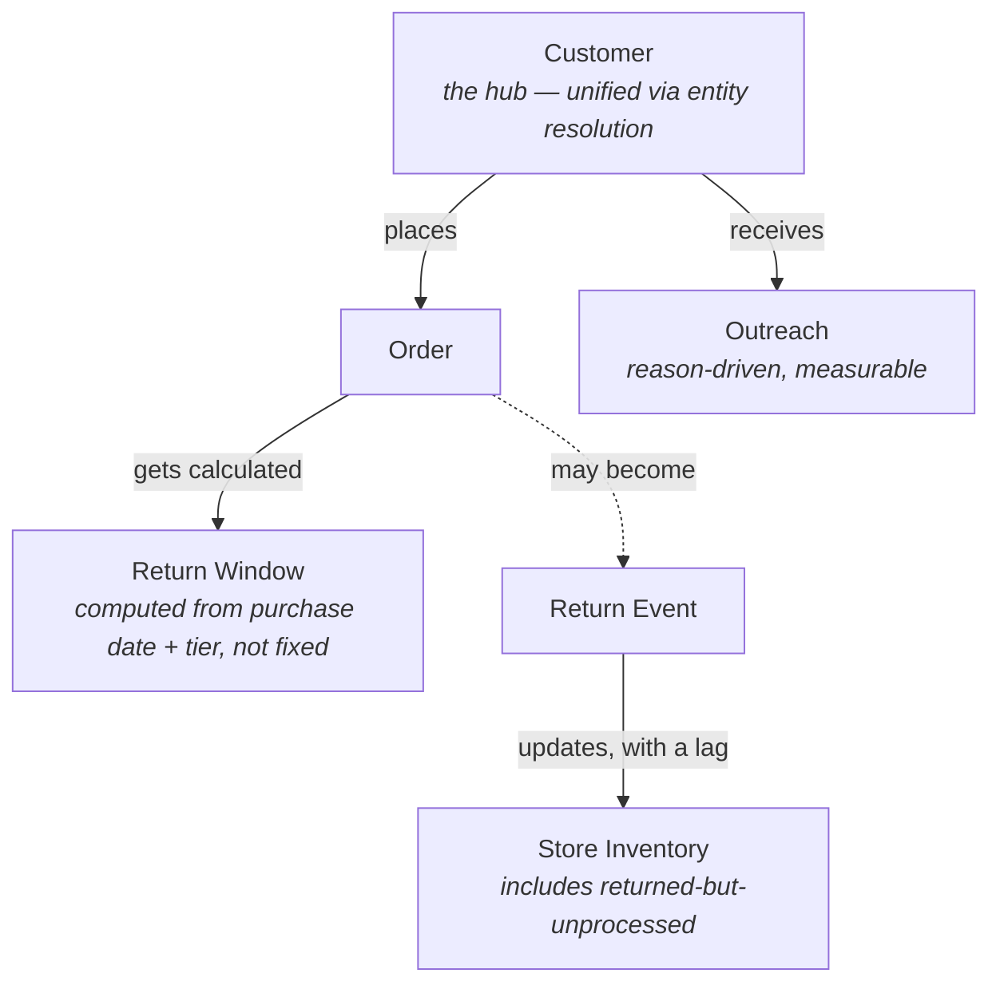

# Data map (ontology)

Six objects, five relationships. `Customer` is the hub — everything else hangs off a resolved identity, not a raw source record.

## The objects

- **Customer** — one row per real person (`clean/customers_spine.csv` → `clean/customers_enriched.csv`), built by entity resolution across POS, ecommerce, and payment-token records that don't share a common ID. Carries `relationship_tier` (new / regular / VIP / watch), computed from purchase history.
- **Order** — a purchase line item (`raw/orders.csv`), tagged with the resolved `customer_id` once ingested.
- **Return Window** — not a fixed policy. Computed per order from the base window adjusted by the customer's *current* relationship tier (`clean/return_windows.csv`): watch gets exactly the base window with no flexibility, VIP gets an extension plus a discretionary grace period.
- **Return Event** — an order that actually got returned (`raw/returns.csv`). Not every order becomes one.
- **Store Inventory** — what the POS system reports (`raw/inventory.csv`) vs. what's actually sellable (`clean/true_inventory.csv`), which accounts for sellable returns sitting unprocessed. The gap between those two numbers is the "ghost stock" problem the brief opens with.
- **Outreach** — contact attempts (`raw/outreach_log.csv` for the old time-blast baseline; `clean/outreach_queue.csv` for the new reason-driven queue), driven by signals from the same Customer profile: a closing return window, VIP dormancy, or a past stock inquiry that just got resolved by a return.

## The relationships

1. **Customer places Order** — via `source_customer_ref`, resolved to `customer_id` through the spine.
2. **Order gets a calculated Return Window** — one row per order in `return_windows.csv`, tier-adjusted.
3. **Order may become a Return Event** — most don't; ~15% do, per `returns.csv`.
4. **Return Event updates Store Inventory, with a lag current systems hide** — 0–7 days typically, sometimes never (the deliberate ~10% "ghost stock" carve-out). `true_inventory.csv` is what closes that gap.
5. **Customer receives Outreach** — driven by reasons computed from the same profile that drives return windows and tier, not a blind send schedule.
